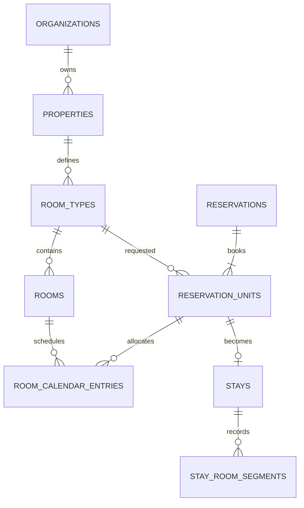
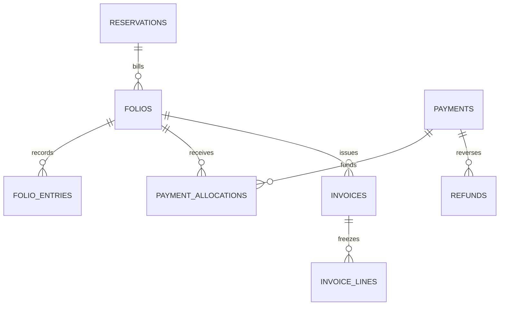

# Resort PMS database blueprint — v1

Proposed PostgreSQL logical design for our eZee-aligned product, not eZee's proprietary schema. Covers the agreed screen catalogue A–N. This is a design specification, not executable migrations or a tested production database. Optional modules can be deployed later.

## 1. Architecture and conventions

One organization owns one or many properties. Users have scoped role assignments. Guests may be shared within an organization, but property staff only see guest profiles connected to authorized stays/enquiries. Separate platform administration from hotel operational access.

Start as a modular application with one PostgreSQL database. Use schemas iam, property, booking, operations, finance, distribution, pos, engagement, ai, integration. Separate microservice databases are unnecessary initially.

All entity primary keys are UUID `id` unless a composite key is stated. Tenant tables include `organization_id NOT NULL`; property-level tables also include `property_id NOT NULL`. All cross-table references must include these scope columns through composite foreign keys, with matching parent unique keys. This prevents a child row in property A referencing a parent in property B. Organization-wide references use (organization_id, id). Global identities and permission catalogues are exceptions.

Mutable entities have created_at/updated_at (timestamptz), created_by actor reference, and version bigint for optimistic concurrency. Date-only stay nights and business dates use date; timestamps are UTC with property IANA timezone retained. Currency is an ISO code; monetary values use numeric(19,4) with explicit currency rounding at posting; never float. Quantities use numeric. JSONB is for external payloads and supplementary metadata, not core foreign keys, money, or permissions.

Status values below are controlled lookup/check values. Financial and historical records cannot be hard-deleted by normal application roles. Archive configuration entities; use reversal entries for posted transactions. Sensitive document bytes and recordings live in private object storage; database stores protected object references, checksums, retention dates and access metadata. Credentials live in a secret manager, referenced by ID.

## 2. Organization, property and access tables

| Table | Important columns beyond standard identifiers | Purpose / constraints |
|---|---|---|
| organizations | name, status | Tenant boundary |
| properties | code, name, timezone, currency, address, checkin_time, checkout_time | Unique organization + code |
| property_modules | module_code, enabled, enabled_at | PK property + module; entitlements are independent of permissions |
| buildings | code, name | Property scoped |
| floors | building_id, code | Unique building + code |
| departments | code, name | Property scoped |
| outlets | code, name, type, department_id | Restaurant/reception outlet scope |
| room_types | code, name, max_adults, max_children, max_occupancy | Positive capacity; property scoped |
| rooms | code, room_type_id, floor_id, active_from, retired_on | Unique property + room code; no single overloaded room status |
| amenities | code, name | Organization catalogue |
| room_type_amenities | room_type_id, amenity_id | Composite PK |
| users | identity_provider, subject_id, display_name, status | Global identity; unique provider + subject; no plaintext passwords |
| memberships | user_id, status | Unique organization + user |
| employees | membership_id, employee_code, department_id | Property employment record, not a separate login |
| permissions | resource_code, action_code | Global unique pair, e.g. reservation.cancel, folio.refund.approve |
| screens | code, route, title | Global UI catalogue A1–N7; UI visibility does not grant API access |
| screen_permissions | screen_code, permission_id | Maps menu visibility to permissions |
| roles | code, name, template_code, active | Organization-owned custom roles; unique organization + code |
| role_permissions | role_id, permission_id, record_scope | Scope property/assigned/own; unique role + permission |
| role_assignments | membership_id, role_id, property_id nullable, outlet_id nullable, scope_type, valid_from, valid_until | Explicit organization/property/outlet scope; CHECK required/null columns; outlet must belong to property |
| approval_policies | action, role_id, property_id, outlet_id nullable, currency, max_amount, max_percent | Per-action limits; null is not unlimited; explicit unlimited flag if needed |
| invitations | email, token_hash, expires_at, accepted_at | Hash invitation token; scope in invitation_grants child rows |
| invitation_grants | invitation_id, role_id, property_id, outlet_id, scope_type | Validated again on acceptance |
| login_sessions | user_id, session_hash, expires_at, revoked_at | No raw refresh tokens |
| support_access_grants | organization_id, property_id, support_user_id, approved_by, expires_at, reason | Time-limited platform support access |

Authorization = active membership AND enabled module AND scoped role permission AND record relationship AND action limit. Multiple roles union allowed permissions only within the SAME scope; a cashier permission at property A must not combine with receptionist scope at B. Deny by default. Guest/agent sessions use explicit portal access relationships, never employee roles.

Seed the 22 role templates previously defined: platform administrator (separate control plane), owner, general manager, property IT administrator, front office manager, receptionist, reservations executive, revenue manager, guest engagement executive, housekeeping supervisor, attendant, guest services executive, restaurant manager, waiter, kitchen staff, restaurant cashier, front desk cashier, finance manager, night auditor, read-only auditor, guest, agent/corporate booker. Guest and agent are portal authorization templates. Do not store a single role column on users.

## 3. Guests, companies and portals

| Table | Important columns | Relationships / rules |
|---|---|---|
| guests | full_name, email, phone, nationality, merged_into_guest_id | Organization scoped; phone/email not unique identifiers |
| guest_preferences | guest_id, preference_code, value, source | Explicit preferences; avoid unnecessary sensitive information |
| guest_documents | guest_id, object_key, type, masked_number, verification_status, verified_by, retention_until | Restricted access; encrypted sensitive fields |
| companies | name, billing_address, tax_identifier | Corporate billing profile |
| travel_agents | name, contact_details, status | Organization profile |
| commercial_accounts | company_id nullable, travel_agent_id nullable, property_id, currency, credit_limit, payment_terms | Exactly one company/agent; property-specific credit |
| guest_property_links | guest_id, property_id, relationship_type | Derived/maintained from real stays or enquiries; does not itself authorize all guest history |
| guest_portal_access | user_id, reservation_id, verified_at, expires_at | Explicit booking access; matching phone alone is insufficient |
| agent_portal_access | user_id, travel_agent_id or company_id, property_id, active | Exactly one commercial principal |
| communication_consents | guest_id, channel, purpose, status, source, recorded_at | Service communication and marketing consent kept distinct |

## 4. Rates and reservation model

| Table | Important columns | Relationships / rules |
|---|---|---|
| booking_sources | code, type, name | Direct, phone, walk-in, OTA, corporate, agent |
| cancellation_policies | name, version, rules | Versioned; booking snapshots retain accepted terms |
| meal_plans | code, name | Breakfast, half/full board etc. |
| rate_plans | code, meal_plan_id, cancellation_policy_id, currency, tax_inclusive, active | Property scoped |
| rate_plan_room_types | rate_plan_id, room_type_id | Supported combinations |
| daily_rates | rate_plan_id, room_type_id, stay_date, adult_count, child_count, amount | Unique combination; define supported occupancy grid |
| rate_restrictions | rate_plan_id, room_type_id, stay_date, min_stay, max_stay, stop_sell, closed_arrival, closed_departure | Unique plan/type/date |
| negotiated_rates | commercial_account_id, rate_plan_id, valid_from, valid_until | Contract association; no overwritten historical quotes |
| packages | code, name, valid_from, valid_until | Bundle definition |
| package_components | package_id, service_code, quantity, pricing_rule | Inclusions and charges |
| promotions | code, validity, usage_limit, discount_rule, active | Redemption checked transactionally |
| promotion_redemptions | promotion_id, reservation_id, status | Prevent repeat/over-limit use |
| reservation_groups | code, name, organizer_guest_id, commercial_account_id, billing_rule | One group can own many reservation headers |
| reservations | number, group_id nullable, primary_guest_id, source_id, commercial_account_id nullable, status, currency, policy_snapshot, confirmed_at | Unique property + number |
| reservation_units | reservation_id, room_type_id, rate_plan_id, arrival_date, departure_date, adults, children, status | One row per room booked, even before physical room assignment; departure > arrival |
| reservation_guests | reservation_unit_id, guest_id, guest_role | Occupants per unit; composite uniqueness |
| reservation_nightly_prices | reservation_unit_id, stay_date, base_amount, discount_amount, tax_amount, total_amount, pricing_snapshot | Unique unit/night; immutable accepted quote versions |
| reservation_revisions | reservation_id, revision_number, reason, before_snapshot, after_snapshot, actor_id | Tracks modifications/cancellation policy decisions |
| enquiries | guest_id nullable, requested_dates, room_type_id, units_requested, status, next_followup_at | No inventory consumption |
| waitlist_entries | enquiry_id, priority, expires_at, status | Converting to hold must recheck inventory |
| booking_holds | reservation_id, expires_at, status, idempotency_key | held/converted/expired/released; unique request key |
| room_type_inventory_days | room_type_id, stay_date, physical_capacity, out_of_service, held_units, reserved_units, allotment_units | PK property/type/date; serialized inventory authority |
| inventory_claims | reservation_unit_id nullable, hold_id nullable, allotment_id nullable, room_type_id, stay_date, claim_kind, status | Provenance for counted inventory; transactionally matches counters |
| allotments | commercial_account_id, room_type_id, start_date, end_date, release_days, status | Guaranteed blocks consume inventory; informational quotas do not |
| allotment_days | allotment_id, stay_date, quantity, picked_up_quantity | Unique allotment/date; pickup transfers inventory rather than double-counting |
| room_calendar_entries | room_id, reservation_unit_id nullable, kind, occupied_period, status, reason | Holds assignments AND maintenance blocks; one shared collision constraint |
| stays | reservation_unit_id, actual_checkin_at, actual_checkout_at, checked_in_by, checked_out_by | Actual stay distinct from planned reservation; unique unit |
| stay_room_segments | stay_id, room_calendar_entry_id, actual_start_at, actual_end_at | Preserves room-change history |

Reservation statuses: draft, held, confirmed, cancelled, completed. Per-unit statuses: reserved, checked_in, checked_out, cancelled, no_show. Group/header status is derived/validated against unit states; mixed groups must not be flattened to one misleading status. Room occupancy derives from allocations/stays; cleanliness derives from housekeeping; sellability derives from inventory and restrictions.

### Concurrency and availability

For each requested night, lock room_type_inventory_days rows in deterministic (property,type,date) order using SELECT FOR UPDATE. Validate all nights, rates and restrictions. In the same transaction insert unit/claims, update counters, insert hold and outbox event. No partial-night allocation on failure. Inventory rows must already exist or be inserted with conflict-safe handling.

Sellable = physical_capacity - out_of_service - held_units - reserved_units - allotment_units. Set deliberate overbooking allowance to zero initially. Physical room assignment does not decrement type inventory again. Check-in does not release reservation inventory. A block must reduce capacity and pass the same type-level validation; blocking an unassigned but already sold room can create an inventory shortage and must be rejected or handled through an explicit relocation exception.

Use a GiST exclusion constraint over (organization_id equality, property_id equality, room_id equality, occupied_period overlap) for active room_calendar_entries. btree_gist supports UUID equality with ranges. Use half-open tstzrange [start,end) with property-local planned check-in/out converted to UTC; add required turnaround buffer explicitly. No separate maintenance table can bypass this room collision authority. Expired holds remain consuming until released transactionally; do not put now() into an index predicate. Worker and booking requests safely expire eligible holds under the same locks.

Room moves atomically update both room calendar segments. If room type changes, transfer inventory claims and adjust nightly prices by an explicit approved revision. Late checkout must validate overlap with the next allocation. On early checkout, release future nights according to policy while retaining actual occupied history.

## 5. Housekeeping and service execution

| Table | Important columns | Rules |
|---|---|---|
| room_condition | room_id, cleanliness, inspected_at, inspector_id, version | One current row/room; dirty/cleaning/clean/inspected |
| housekeeping_tasks | room_id, task_type, priority, due_at, status, assigned_employee_id | Tasks are scoped to property and department |
| task_events | task_id, actor_id, event, occurred_at | Append-only history |
| room_inspections | task_id, inspector_id, result, notes | Cannot approve own cleaning where separation is enabled |
| inspection_items | inspection_id, checklist_code, result | Composite key |
| service_catalog | code, name, department_id, default_price, tax_rule_id | Extra bed, laundry, minibar etc. |
| service_requests | stay_id, service_id, quantity, status, due_at, assigned_employee_id, source | open/assigned/in_progress/completed/cancelled |
| service_request_events | request_id, event, actor_id, occurred_at | Tracks escalation/completion |

Checkout emits a room-dirty event atomically. Cleaning completion does not automatically imply inspected. Service billing uses a unique source reference so retries cannot post twice.

## 6. Billing, payments and night audit

| Table | Important columns | Rules |
|---|---|---|
| folios | reservation_id nullable, group_id nullable, commercial_account_id nullable, type, currency, status | Guest/group/company/paymaster; supported ownership combinations checked |
| folio_reservation_units | folio_id, reservation_unit_id | Supports routing several rooms to one folio |
| charge_routing_rules | reservation_unit_id/group_id, charge_category, destination_folio_id | Explicit route by category; validate scope/currency |
| charge_codes | code, revenue_category, tax_rule_id | Room, restaurant, laundry etc. |
| tax_rules | code, version, effective_dates, calculation_rule | Configurable jurisdiction rules, not hard-coded universal percentages |
| folio_entries | folio_id, entry_type, amount, currency, business_date, charge_code_id, reversal_of_id, source_type, source_id, source_line_key | Immutable posted debit/credit entries; unique source posting key |
| folio_entry_taxes | folio_entry_id, tax_code, rate_snapshot, taxable_amount, tax_amount | Historical tax snapshots |
| payment_intents | provider_connection_id, reservation_id/folio_id, expected_amount, currency, status, idempotency_key | Request to collect, not proof of collection |
| payments | intent_id, provider_transaction_id, method, amount, currency, status, received_at, cashier_shift_id | Only settled/successful events affect collection |
| payment_allocations | payment_id, folio_id, amount, folio_entry_id | Can split payment across folios; lock payment and prevent over-allocation |
| refunds | payment_id, amount, currency, reason, approval_request_id, provider_refund_id, status | Sum successful/pending refunds cannot exceed refundable balance; lock payment |
| invoices | folio_id, invoice_number, status, issued_at, customer_snapshot, totals_snapshot | Final issue freezes contents; unique property + fiscal series + number |
| invoice_lines | invoice_id, folio_entry_id, description_snapshot, quantity, amounts_snapshot | Posted source links, no duplicate charge invoicing |
| credit_notes | invoice_id, number, reason, amount, issued_at | Correct issued invoices without mutation |
| cashier_shifts | employee_id, outlet_id, opened_at, closed_at, opening_cash, declared_cash, expected_cash, variance | Closed shifts immutable |
| business_days | business_date, status, closed_at, closed_by | Unique property/date; open/closing/closed |
| night_audit_runs | business_date, run_number, status, started_at, completed_at | Only one successful close/day |
| night_audit_steps | run_id, step_code, status, error | Retryable steps; posting idempotency keys per unit/night/charge |
| approval_requests | action, entity_type, entity_id, entity_version, payload_hash, requested_by, policy_snapshot, expires_at, status | Approval binds to exact amount/version; generic target validated by service |
| approval_decisions | request_id, approver_id, decision, comment, decided_at | Reject self-approval where required; append-only |

Folio balance is posted debits minus posted credits, using a documented entry-type sign convention. Payment success posts one credit per allocation. Refund success posts the appropriate debit/reversal, not a negative payment that can be counted twice. Transfers use linked debit/credit reversal/repost entries in one transaction; never edit a posted entry's folio_id. Financial same-currency checks and allocation/refund sum constraints need transactional functions or deferred triggers, not simple row CHECKs.

Cash collections, earned revenue and outstanding balances are separate report measures. This PMS subledger is not a full general ledger. Profit reports require an accounting integration or a separately designed balanced journal/expense ledger. Do not label revenue as profit. Paymaster folios do not create fictitious sellable physical rooms.

Night audit locks the business day, prevents new posting into the closing day, posts missing nightly charges idempotently, reconciles exceptions, closes, and advances the business date. Late provider events retain their real received time and post adjustments into an open business date.

## 7. Distribution, direct booking and revenue tools

| Table | Important columns | Purpose |
|---|---|---|
| channel_connections | provider, external_property_id, secret_reference, status | One property/provider account |
| channel_room_mappings | connection_id, room_type_id, external_room_type_id | Unique external mapping |
| channel_rate_mappings | connection_id, rate_plan_id, external_rate_id | Rate mapping |
| external_reservation_links | connection_id, external_reservation_id, reservation_id, external_revision | Unique connection/external ID |
| channel_sync_jobs | connection_id, operation, payload_reference, status, attempts, next_retry_at | Retry/backoff and latest-version handling |
| booking_engine_configs | property_id, theme, public_slug, enabled | No secrets in public config |
| room_media | room_type_id, object_key, sort_order, caption | Public approved room photos |
| rate_recommendations | room_type_id, stay_date, proposed_rate, model_version, explanation, status | Recommendation distinct from published rate |
| rate_publications | recommendation_id nullable, daily_rate_id, old_amount, new_amount, approved_by, published_at | Audited pricing changes |

OTA incoming bookings use the same booking/inventory path, not direct table writes. Duplicate webhooks cannot create duplicate reservations. If an OTA confirms inventory no longer available, retain the external booking in a visible reconciliation exception queue; never silently discard or pretend confirmation succeeded locally. Rate publication occurs through a transactional outbox. Live PMS remains authoritative; channel cache lag is observable.

## 8. Restaurant POS (optional module)

| Table | Important columns | Rules |
|---|---|---|
| dining_tables | outlet_id, code, capacity | Unique outlet/code |
| menu_items | outlet_id, code, name, active | Prices versioned/snapshotted on order |
| menu_prices | menu_item_id, amount, currency, effective_dates | Outlet pricing |
| modifiers | menu_item_id, name, price_delta | Choices |
| pos_orders | outlet_id, dining_table_id nullable, stay_id nullable, status, waiter_id | Dine-in/room service/takeaway |
| pos_order_lines | order_id, item_id, quantity, unit_price_snapshot, tax_snapshot, status | Historical price |
| pos_line_modifiers | order_line_id, modifier_id, name_snapshot, price_snapshot | Applied options |
| kitchen_tickets | order_id, station, status, sent_at, ready_at | Work tracking |
| kitchen_ticket_lines | ticket_id, order_line_id, quantity | Ticket/order-line link |
| pos_settlements | order_id, payment_id nullable, folio_entry_id nullable, amount | Exactly one settlement target; partial settlements supported |
| stock_items | outlet_id, code, unit, reorder_level | Optional stock catalogue |
| stock_movements | item_id, quantity_signed, reason, source_reference, occurred_at | Append-only stock ledger |
| recipe_items | menu_item_id, stock_item_id, quantity | Recipe quantities |

Room posting validates active stay, charge privileges and currency, then creates exactly one folio charge with POS source key. Order total minus valid settlements is the remaining balance; do not collect again after room posting. Restaurant tax and discount snapshots are separate from room tax rules.

## 9. Communications, guest portal and AI

| Table | Important columns | Rules |
|---|---|---|
| conversations | channel, guest_id nullable, reservation_id nullable, assigned_employee_id, status | Property scoped |
| messages | conversation_id, provider_message_id, sender_type, body_reference, sent_at, delivery_status | Deduplicate provider ID per connection |
| calls | conversation_id, provider_call_id, started_at, ended_at, recording_key, transcript_key, retention_until | Restricted recording access |
| message_templates | channel, purpose, version, content, approval_status | Booking/service/marketing |
| campaigns | template_id, segment_rule, status, scheduled_at | Optional marketing module |
| campaign_recipients | campaign_id, guest_id, consent_snapshot, delivery_status | Consent rechecked before send |
| reviews | source, external_review_id, guest_id nullable, rating, body, posted_at | Unique source + external ID/property |
| review_replies | review_id, draft_body, approved_by, published_at, status | Track AI draft vs actual publication |
| feedback | stay_id, rating, comment, resolution_status | Guest feedback |
| knowledge_documents | version, title, object_key, approved_by, status, valid_until | Only approved applicable content retrieved |
| knowledge_chunks | document_id, content, embedding_reference | Optional vector search; tenant filters mandatory |
| ai_agent_configs | channel, model_reference, prompt_version, enabled | Config, not model credentials |
| ai_tool_policies | agent_config_id, tool_code, approval_required, limit_policy_id | AI policy may narrow, never expand human/guest access |
| ai_runs | conversation_id, actor_id, acting_membership_id nullable, model_version, status, usage, started_at | Preserve effective caller identity |
| ai_tool_executions | run_id, tool_code, redacted_arguments, result_reference, approval_request_id, idempotency_key, status | No direct arbitrary SQL; tool uses normal service permissions |
| workflow_definitions | event_type, version, config, enabled | n8n reference or internal workflow |
| workflow_runs | definition_id, source_event_id, status, attempts | Retry/dedupe |

AI has no independent reservation or payment database. Calls and chat use normal booking APIs. A guest's verified portal/call session scopes access to that booking; never trust a spoken room number alone. Recordings/transcripts and IDs must not appear in ordinary housekeeping or analyst views.

## 10. Integration and audit foundation

| Table | Important columns | Rules |
|---|---|---|
| integration_connections | provider, purpose, secret_reference, status | Property-scoped configured systems |
| webhook_inbox | connection_id, external_event_id, payload_reference, signature_verified, status, received_at | Unique connection/event; verify before processing |
| outbox_events | aggregate_type, aggregate_id, event_type, payload, occurred_at, published_at | Insert atomically with business change |
| idempotency_requests | operation, key, actor_id, request_hash, result_reference, expires_at | Unique tenant/property/operation/key; reject key reused for another payload |
| reconciliation_exceptions | source_type, source_id, category, severity, assigned_to, status | Payment, inventory and OTA issues |
| audit_events | actor_id, property_id, action, entity_type, entity_id, redacted_before, redacted_after, reason, correlation_id, occurred_at | Append-only; audit privileged reads/exports too |
| report_jobs | requested_by, report_code, authorized_scope_snapshot, filters, status, output_key, expires_at | Revalidate scope at generation and download |

## 11. Relationships

## 12. Indexes, security and operating checks

Index child FK columns explicitly. Typical composites: reservations(property_id,status,created_at), units(property_id,arrival_date,status), units(property_id,departure_date,status), folio_entries(property_id,folio_id,business_date), tasks(property_id,assigned_employee_id,status,due_at), messages(property_id,conversation_id,sent_at), inventory days primary key, external reservation unique mapping and provider event unique keys. Use partial indexes for active task/queue states. Partition large audit/message/event tables by time only after measuring volume; partition design must preserve required uniqueness and retention.

Enable and force row-level security for tenant/property tables. Runtime role must not own tables or have BYPASSRLS. Server binds authenticated tenant/user/property transaction context; no client-provided arbitrary tenant setting. RLS is defense in depth, not a substitute for API permissions, masking and purpose-specific views. Connection-pool context must be transaction local. Restrict global user table reads. Backup/restore operators have separate audited access.

Reports derive from source ledgers or rebuildable projections. Do not maintain dashboard totals through unrelated ad-hoc updates. Nightly operational dates use property timezone/business day, not database UTC date alone. Backups need point-in-time recovery and periodic restore drills; retention is configured per data type and jurisdiction.

## 13. Implementation order and acceptance gates

1. Organizations, properties, identities, permissions, rooms and tenant-safe FKs/RLS.
2. Guest profiles, rates, reservations, inventory claims, room calendar and stays.
3. Folios, payments, approvals, invoices, reconciliation and night audit.
4. Housekeeping, guest requests, portals, distribution and direct booking.
5. POS, engagement, reporting, revenue tools and AI adapters as enabled modules.

Required tests before production: two simultaneous last-room bookings yield only one success; overlapping block and reservation rejected; expired hold released once; all-night rollback on one-night shortage; room move retains history; group allotment pickup not double-counted; duplicate OTA reservation creates no duplicate; duplicate payment callback posts once; late payment after hold expiry creates exception/refund workflow without taking another guest's room; split allocations never exceed captured funds; concurrent refunds remain bounded; closed night audit retried without duplicate charges; tenant A cannot reference/read tenant B; property-specific role grants do not leak across properties; housekeeper cannot retrieve IDs; guest cannot access another reservation; AI tool cannot exceed caller access; cancelled/revised approval payload cannot execute under an old approval.

## 14. Boundaries and pending deployment decisions

This blueprint covers product domains and critical invariants. Executable DDL must still specify every nullable/default value, status lookup, composite foreign key, index, RLS policy, transactional function and migration order. Not claimed as implemented or tested. Payment provider, target tax jurisdiction, accounting integration, supported day-use behavior and OTA contracts determine final adapter/configuration details. No legal tax rules or guaranteed eZee feature parity are implied.

Technical references: PostgreSQL row security https://www.postgresql.org/docs/current/ddl-rowsecurity.html ; ranges and non-overlap constraints https://www.postgresql.org/docs/current/rangetypes.html .
